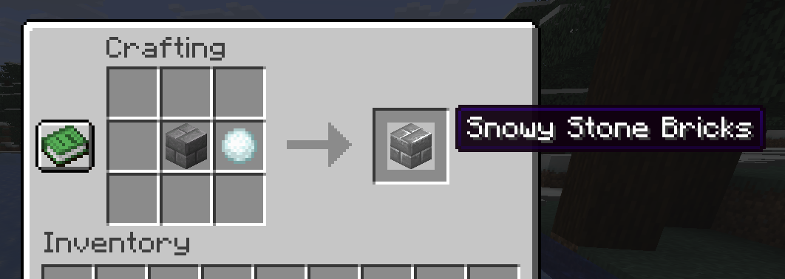
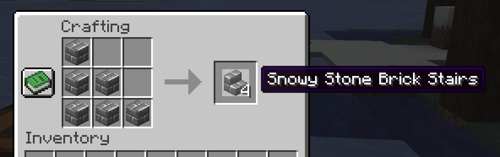
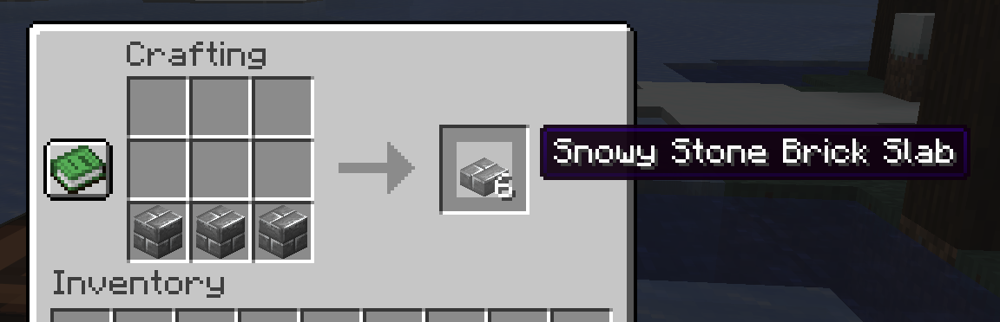
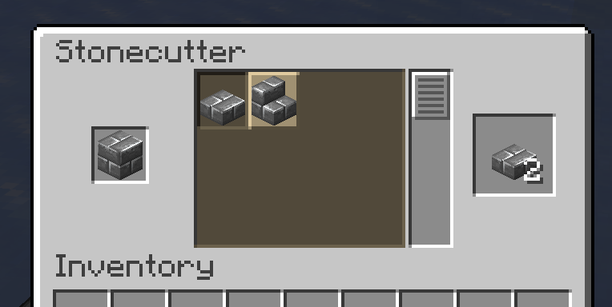

  <h1>
    Snowy stone bricks (Spout)
  </h1>

<table>
  <tr>
    <td>
      
    </td>
    <td>
      
    </td>
  </tr>
</table>

## Introduction

Adds fully server-side snowy stone bricks, including stairs and slabs.

<table>
  <tr>
    <td>
      
    </td>
    <td>
      
    </td>
    <td>
      
    </td>
    <td>
      
    </td>
  </tr>
</table>

## Download

* [Latest version: 1.0 (MC 1.21.11)](https://github.com/ModernSpout/SnowyStoneBricks-plugin/releases/download/1.0/SnowyStoneBricks-1.0.jar)
* Development versions: download from
  [Actions](https://github.com/ModernSpout/SnowyStoneBricks-plugin/actions/workflows/build.yml),
  under **Artifacts**
* [Older releases](https://github.com/ModernSpout/SnowyStoneBricks-plugin/releases)

## Installation

Place the `.jar` file into the `plugins` folder.

Requires [Spout](https://github.com/ModernSpout/Spout-Paper-server).
